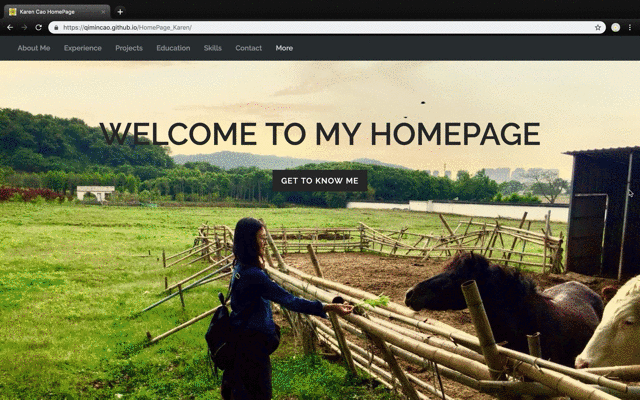
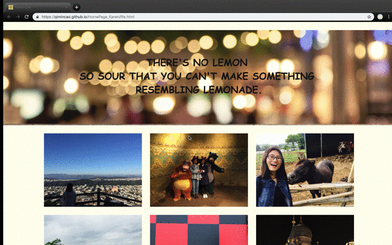

# [My Personal Web Page](https://qimincao.github.io/HomePage_Karen/)

## :person_with_pouting_face: Author
I am [Karen Cao](https://qimincao.github.io/HomePage_Karen/). This is my personal webpage. I want to show people more about me. It includes: 
- Brief info
- Experience
- Education
- Projects
- Skills
- Contact

Welcome to my home page and get to know me. 😊

## :star2: Project Objective
1. Serving as an opportunity to apply web techonologies, including HTML5, CSS3, Bootstrap4 and basic JavaScript.
2. Laying the foundation of future projects.
3. A great alive resume.

  CS5610 Course Link: http://johnguerra.co/classes/webDevelopment_spring_2019/ Love Professor John!

## :metal: Technologies
- HTML5
- CSS3
- Bootstrap4
- JavaScript
- JQuery
- Google fonts
- Slick js (slides)
- Git

## :smirk_cat: Deployment
 1. Clone or download the repository to a local folder.
 2. Intall a web server via npm. Related link: https://www.npmjs.com/package/http-server
 3. Get to the project folder, open terminal and start the server.
 4. Open the showed URL "localhost:8080" in the browser.  

## :eyes: Video and Slides
Video demo of this project can be found [here](https://youtu.be/k_eF_y8wGkQ). 

Slide of this project can be found [here](https://docs.google.com/presentation/d/1MhnssvWt08CroN1zR4yJYBhmsmEtfFmlnH06-3qx4WY/edit#slide=id.g4b2061021d_0_882).

## :exclamation: License

This repository has the standard [MIT license](https://opensource.org/licenses/MIT). 